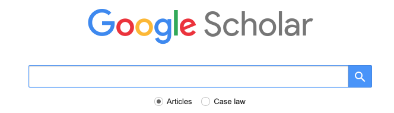
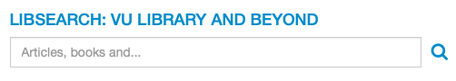
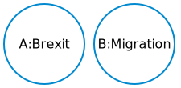
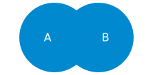
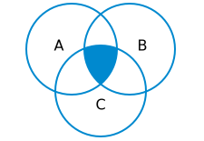

```{r setup, include=FALSE}
options(htmltools.dir.version = FALSE)
knitr::opts_chunk$set(fig.retina = 3)
```

```{r xaringan-themer, include=FALSE, warning=TRUE}
library(xaringanthemer)
style_mono_accent(
  base_color = "#0089CF",
  base_font_size = "24px",
  header_h1_font_size = "2.5rem",
  header_h2_font_size = "2rem",
  header_h3_font_size = "1.5rem",
  title_slide_background_image = "img/lost-at-sea.png",
  title_slide_background_size = "cover",
  title_slide_background_position = "right",
  text_bold_color = "var(--text-color)",
  extra_css = list(
  ".title-slide h1, h2, h3" = list(
    "text-align" = "left",
    "vertical-align" = "top",
    "text-transform" = "capitalize"
  ),
  ".title-slide h1" = list(
  "margin-top" = "-110px"
  ),
  ".remark-slide-number" = list(
  "display" = "none"
  ),
  ".card.list" = list(
    "position" = "relative",
    "left" = "20%",
    "box-shadow" = "0 4px 8px 1px rgba(0,0,0,0.05)",
    "border-radius" = "4px",
    "width" = "65%",
    "margin-bottom" = "15px"
  ),
  ".card.switch" = list(
    "position" = "relative",
    "box-shadow" = "0 4px 8px 1px rgba(0,0,0,0.05)",
    "border-radius" = "4px",
    "width" = "65%",
    "float" = "left",
    "margin-bottom" = "15px"
  ),
  ".card.small" = list(
    "position" = "absolute",
    "border-radius" = "4px",
    "margin" = "15px",
    "padding" = "5px",
    "background-color" = "rgba(0, 137, 207, 0.1)"
  ),
  ".card.highlight" = list(
    "background-color" = "rgba(136, 63, 160, 0.1)"
  ),
  ".card h2" = list(
    "color" = "white",
    "background-color" = "rgba(0, 137, 207, 0.4)",
    "font-size" = "1.1rem",
    "padding" = "5px",
    "margin-top" = "0",
    "margin-bottom" = "4px",
    "border-radius" = "4px 4px 0 0"
  ),
  ".card.switch ul, div.card ol" = list(
  "margin-bottom" = "4px",
  "padding-bottom" = "15px"
  ),
  ".card p" = list(
  "margin" = "10px"
  ),
  ".card.switch.right" = list(
  "float" = "right",
  "text-align" = "left"
  ),
  ".inverse .takeaways" = list(
      "position" = "absolute",
      "width" = "65%",
      "bottom" = "60px",
      "right" = "20px",
      "padding-right" = "4em",
      "text-align" = "left"
  )
  # "div.card-switch ~ div.card1" = list(
  # "margin-top" = "0"
  # )
)
)
```
# Before we start
Welcome! Glad your here. These slides should mostly be self explanatory, but some guidelines for usage may be useful. 

1. Links are formatted like [this](https://ub.vu.nl/nl/index.aspx). Many images are also links, although this may not be obvious from the formatting.
2. On some slides, additional explanation is available. Use the controls as below to learn more.

<!-- <audio controls> -->
<!--   <source src="audio/test.ogg" type="audio/ogg"> -->
<!--   <source src="audio/test.mp3" type="audio/mpeg"> -->
<!-- Your browser does not support the audio element. -->
<!-- </audio> -->

???

Hallo! Ik ben Matthijs de Zwaan, en ik werk bij de universiteitsbibliotheek van de VU. Zoals je ondertussen wel door zal hebben, zijn de slides in het Engels, maar is mijn uitleg in het Nederlands.

Deze les gaat over het vinden van informatie voor werkstukken die je tijdens je studie zult schrijven. Zulke informatie vindt je in academische artikelen, maar ook in bijvoorbeeld kranten, vaktijdschriften, of *social media*. 

We zullen beginnen met een aantal meer algemene onderwerpen. Allereerst de vraag waarom je eigenlijk uberhaupt informatie nodig hebt voor een werkstuk. Daarna gaan we door met het verkennen van verschillende bronnen van informatie, en welke aspecten van belang zijn om te bepalen waarom je een bepaalde bron wel of niet wilt gebruiken. Daarna wordt het meer praktisch, en bespreken we een aantal zoekmachines die je kan gebruiken om te zoeken naar informatie, en welke methodes je kan gebruiken om te zoeken.  

---
class:inverse
# Why do you need information?
---

# Why do you need information?
<div class="card switch">
<h2>Context</h2>
<p>How does this work fit into other discussions?</p>
<p>What arguments were made previously?</p>
</div>

<div class="card switch right">
<h2>Motivation</h2>
<p>Why is this work important / interesting?</p>
</div>

<div class="card switch">
<h2>Novelty</h2>
<p>You can only argue that your work adds something new if you first show what has been done before.</p>
</div>

???
Informatie speelt een belangrijke rol bij de onderbouwing van academisch werk. Er wordt daarom ook van je verwacht dat je gedegen zoekt naar bronnen van informatie, en ook goed documenteert welke bronnen je uiteindelijk gebruikt.

Ik noem hier drie belangrijke rollen voor informatie.

Je kan informatie gebruiken om de context van je werk te schetsen. Aan welke discussies draagt je werk bij? 

Je kan informatie ook gebruiken om te motiveren waarom je je onderzoek doet. Waarom is het belangrijk om een antwoord te vinden op je onderzoeksvraag? Wat schieten we daarmee op?

Ten derde kun je informatie gebruiken om te laten zien wat jouw werk toevoegt. Dat kan je natuurlijk alleen overtuigend doen als je eerst laat zien wat er eerder al gedaan is.

Informatie is niet altijd per se nodig. Je kan je voorstellen dat je het belang van je onderzoek beargumenteert zonder te refereren aan ander materiaal. Maar waarom zou je het wiel opnieuw uitvinden? Natuurlijk kost het tijd om informatie te zoeken en te verwerken, maar ik ben er van overtuigd dat het meer tijd kost om alle argumenten en discussies zelf te bedenken. Bovendien is je verhaal waarschijnlijk overtuigender als je kan refereren aan betrouwbare bronnen.
---
class:inverse

# Where can you find information?

<!-- <div class="takeaways"> -->
<!-- <p>Er zijn veel verschillende bronnen van informatie. Welke bron het meest geschikt is, hangt af van de vraag die je probeert te beantwoorden, en welke informatie je zoekt. Ook voor academisch werk kan je heel goed putten uit niet-academische bronnen, als je je maar bewust bent van de beperkingen.</p> -->
<!-- </div> -->
???
Er zijn veel verschillende bronnen van informatie. Welke bron het meest geschikt is, hangt af van de vraag die je probeert te beantwoorden, en welke informatie je zoekt. Ook voor academisch werk kan je heel goed putten uit niet-academische bronnen, als je je maar bewust bent van de beperkingen.
---

# Where can you find information?
<span class="card small" style="top:48%;left:27%">Personal blogs, vlogs, etc</span>
<span class="card small" style="top:35%;left:74%">Company websites</span>
<span class="card small" style="top:26%;left:69%">(Inter)national organisations</span>
<span class="card small" style="top:30%;left:11%">Newspapers & magazines</span>
<span class="card small" style="top:60%;left:62%">Your friends after a night<br>on the town</span>
<span class="card small" style="top:40%;left:58%">Wikipedia</span>
<span class="card small" style="top:80%;left:22%">Political parties</span>
<span class="card small" style="top:61%;left:26%">Social media</span>
<span class="card small" style="top:29%;left:53%">Documentaries</span>
<span class="card small" style="top:72%;left:51%">Academic studies</span>
---

# Aspects of information

<div class="card list" style="margin-top:100px;margin-bottom:50px;">
    <h2>Time versus trust</h2>
    <p>How difficult is it to check the information?</p>
    <p>How much time does it take?</p>
</div>

<div class="card list">
    <h2>Objectives</h2>
    <p>Why was the information provided?<br>Persuasion or information?</p>
</div>

???
Er zitten veel verschillende aspecten aan informatie, teveel om hier te behandelen. Twee belangrijke aspecten worden hier kort besproken.

Ten eerste is er de vraag van betrouwbaarheid versus tijdigheid. Het kost tijd om informatie te verifieren. Daarom is er een afweging tussen tijdige informatie (dat wil zeggen, informatie die snel beschikbaar is), en betrouwbare informatie (dat wil zeggen, informatie die juist is). Relatief eenvoudige informatie is makkelijk te checken, en kan daarom zowel snel beschikbaar als betrouwbaar zijn. Feitelijke informatie over onomstreden onderwerpen is hier een voorbeeld van. Maar voor meer complexe informatie, zoals academisch onderzoek, duurt het vaak langer voordat de informatie beschikbaar is. In sommige gevallen worden onderzoeken zelfs pas gepubliceerd jaren nadat ze uitgevoerd zijn.

Ten tweede is er de vraag van objectiviteit. Met welk doel wordt de informatie beschikbaar gemaakt? Wil de auteur informeren, of overtuigen? Wat voor vooroordelen of "bias" komt daaruit voort? Dit is vaak een lastige kwestie: vaak zijn auteurs zich zelf niet goed bewust van hun vooroordelen, en wordt daardoor bepaalde informatie onbewust niet bij het onderzoek betrokken. Het zou zelfs jou kunnen overkomen...
---

# Where can you find information?

<div class="card list" style="position:relative;top:10%;">
    <h2>Search broadly</h2>
    <p>No need to limit yourself to academic studies</p>
    <p>Different sources can answer different kinds of questions</p>
    <p>Be aware of your information source and its limits.</p>
</div>

---

# Where can you find information?

<div class="card switch">
    <h2>Interesting topics & relevant discussions</h2>
    <p>
        Social media (Twitter)</br>
        Newspapers & magazines
    </p>
</div>

<div class="card switch right">
    <h2>Opinions & points of view</h2>
    <p>NGOs, political organizations, companies</p>
</div>

<div class="card switch">
    <h2>Background info</h2>
    <p>Wikipedia</br>
        Textbooks, handbooks</p>
</div>

<div class="card switch right">
    <h2>Detailed analysis, &ldquo;proof&rdquo;</h2>
    <p>Academic books/articles</p>
</div>

???
Tot nu toe was dit een vrij abstract verhaal. Hier worden een paar meer praktische tips gegeven voor bronnen die je voor je werk kan gebruiken.
---

class:inverse

# Finding information<br>from different sources

???

In dit gedeelte gaan we verder in op het zoeken naar verschillende soorten informatie. We zullen ons beperken tot het zoeken naar informatie in kranten en tijdschriften, en het zoeken naar academische boeken en artikelen. Voor academisch werk worden deze soorten informatie het meest gebruikt. 

We beginnen met het bespreken van verschillende zoekmachines en databases. Daarna gaan we verder met de zoekmethodes die je kunt gebruiken.
---

# Finding information<br>from different sources
<span class="card small" style="top:48%;left:27%">Personal blogs, vlogs, etc</span>
<span class="card small" style="top:35%;left:74%">Company websites</span>
<span class="card small" style="top:26%;left:69%">(Inter)national organisations</span>
<span class="card small highlight" style="top:30%;left:11%">Newspapers & magazines</span>
<span class="card small" style="top:60%;left:62%">Your friends after a night<br>on the town</span>
<span class="card small" style="top:40%;left:58%">Wikipedia</span>
<span class="card small" style="top:80%;left:22%">Political parties</span>
<span class="card small" style="top:61%;left:26%">Social media</span>
<span class="card small" style="top:29%;left:53%">Documentaries</span>
<span class="card small highlight" style="top:72%;left:51%">Academic studies</span>

---
layout: false

# Access to information

<div class="card list" style="margin-top:80px;margin-bottom:50px;">
    <h2>On campus</h2>
    <p>
        Should have access automatically<br>
        If not: Log on to VUnet<br>
        But: <i>no one is on campus...</i>
    </p>
</div>

<div class="card list">
    <h2>Off campus</h2>
    <p>
        Log on to VUnet<br>
        Search materials using <a href="#libsearch">Libsearch</a><br>
        See <a href="https://ub.vu.nl/en/search-help/off-campus-access/index.aspx" target=_blank>this information</a>.
    </p>
</div>

---
name: template-nexis

# Finding information in<br>magazines & newspapers

<div class="card list">
    <h2>Options</h2>
    <p>Browse the paper</p>
    <p>Search the website</p>
    <p>Search Nexis Uni</p>
</div>

---
name:nexis

# Nexis Uni

<a href="http://linker2.worldcat.org/?jHome=https%3A%2F%2Fvu-nl.idm.oclc.org%2Flogin%3Furl%3Dhttp%3A%2F%2Fwww.nexisuni.com&linktype=best"></a>

???
Nexis Uni is een zeer uitgebreide database, waarin je onder andere kan zoeken naar artikelen in kranten en tijdschriften, zowel in Nederlandse publicaties als internationale. Klik op de screenshot van de homepage om naar de webite te gaan.

De database is erg uitgebreid, maar het kan lastig zijn om er je weg in te vinden. Op de volgende slide vind je handleidingen die je op weg kunnen helpen.

---
# Getting started with Nexis Uni

.center[
These tutorials can help you find your way in Nexis Uni.

<iframe width="420" height="315" src="https://www.youtube.com/embed/YiT94DEAcw0?controls=0"></iframe>

<iframe width="420" height="315" src="https://www.youtube.com/embed/MYaheJh57N0?controls=0"></iframe>

]

- Also see [https://libguides.vu.nl/nexis-uni]()
- [Skip ahead](#search-title) for search methods

---

# Finding academic publications

<a href="#google">
    
</a>

<a href="#libsearch">
    
</a>

<a href="#scopus">
    
</a>

???
We gaan nu verder met het zoeken naar academische documenten. Er zijn veel manieren om daarnaar te zoeken. Ik bespreek de voor- en nadelen van drie verschillende zoekmachines.
---
name:google

# Finding academic publications:<br>Google Scholar

<a href="https://scholar.google.nl/" target=_blank>
    
</a>

<div style="position:absolute; left: 30%; width:60%; bottom:5%">
    <p>&#x1F60D; Easy to use</p>
    <p>&#x1F914; Results not consistent or transparent</p>
    <p>&#x1F914; Many sources, no quality assessment</p>
</div>
---
name:libsearch

# Finding academic publications:<br>VU Libsearch

<a href="https://vu.on.worldcat.org/discovery" target=_blank>
    
</a>

<div style="position:absolute; left: 30%;width:60%;bottom:5%">
    <p>&#x1F60D; Access & availability of materials are clear</p>
    <p>&#x1F60D; Includes books, data, other resources</p>
    <p>&#x1F914; Not easy to use</p>
</div>

---
name:scopus

# Finding academic publications:<br>Scopus

<a href="https://libguides.vu.nl/scopus" target=_blank>
    
</a>

<div style="position:absolute; left: 30%; width:60%;bottom:5%">
    <p>&#x1F60D; Easy to use.</p>
    <p>&#x1F60D; &ldquo;Advanced search&rdquo; very good for filtering</p>
    </p>&#x1F914; <span style="text-align:left;">Only <a href="https://en.wikipedia.org/wiki/Scholarly_peer_review" target=_blank>peer-reviewed</a> materials:<br>
        &emsp; - Indication of quality<br>
        &emsp; - Not very recent
        </p>
</div>

--


???

Ik raad de Scopus zoekmachine om te zoeken naar academische literatuur. De voornaamste reden hiervoor -- en dat is ook meteen het voornaamste verschil met Google Scholar -- is de beperking tot werken die *peer-reviewed* zijn. Dat betekent dat het werk door vakgenoten van de auteur zijn beoordeeld. Het is dus een soort kwaliteitscheck. Je kan meer lezen over *peer review* in de link op de pagina. Google Scholar geeft ook resultaten van documenten die zo'n peer review niet hebben doorlopen. Het nadeel is wel dat peer review vaak erg lang duurt, en dat je daarom inScopus daarom niet het meest recente onderzoek terugvindt. Als je later in je studie meer bekend raakt met je vakgebied, kan je waarschijnlijk zelf beter kwaliteit onderscheiden. Wellichtd at je dan meer durft te vertrouwen op Google Scholar. Maar in het eerste jaar van je studie is het risico groot dat je literatuur tegenkomt die niet betrouwbaar is, maar dat je zelf nog niet de kwaliteit goed kan inschatten.

In de slides hierna link ik naar handleidingen voor het gebruik van Scopus.

---
# Getting started with Scopus

.center[
<iframe width="420" height="315" src="https://www.youtube.com/embed/-VE3ADZvoUY?controls=0"></iframe>

<iframe width="420" height="315" src="https://www.youtube.com/embed/0oQ5qsDMoFE?controls=0"></iframe>
]

- Scopus provides a number of other [tutorials](https://service.elsevier.com/app/answers/detail/a_id/14799/supporthub/scopus/)
- [Useful guide](https://libguides.library.uu.nl/scopus_en/) (<strong>NB!</strong> From Utrecht University Library, links do not always work for VU students!)
- [Skip ahead](#search-title) for search methods

---
name:search-title
class:inverse

# How to search

???

In dit deel gaan we aan de slag met verschillende zoekmethodes die je kan gebruiken om te zoeken naar literatuur. De principes van die methode worden bij bijna elke zoekmachine gebruikt, al kunnen er verschillen zijn in de details.

Het doel van deze zoekmethodes is uiteindelijk om zoveel mogelijk relevante literatuur te vinden, maar daarbij voorkomt dat je veel onbruikbare resultaten terugkrijgt. Dat is bijvoorbeeld het nadeel van simpelweg je onderwerp intypen in Google: je krijgt wel erg veel resultaten, maar een aanzienlijk deel daarvan is niet bruikbaar voor je werkstuk. De tijd die je dan kwijt bent aan het uitpluizen van wat bruikbaar is, en wat niet, kan je dan beter investeren in het opstellen van een goede zoekvraag in een zoekmachine die gespecialiseerd is in het type informatie dat je wilt hebben. Zoals Scopus.

---
layout: true

# How to search: &ldquo;building blocks&rdquo;


---
<div class="pull-left">

<!-- Venn diagram 1:set up -->

</div>

<div class="pull-right">
    <div class="card switch" style="width:100%;">
        <h2>Example:</h2>
        <p>How will <em>Brexit</em> affect <em>migration</em> patterns?</p>
    </div>
</div>


???
De zogenaamde *building blocks* methode maakt gebruik van simpele operatoren om verschillende onderwerpen aan elkaar te koppelen. Het idee achter de methode is niet ingewikkeld, maar desondanks erg krachtig. Door verschillende onderwerpen of concepten op een slimme manier in je zoekvraag te koppelen, kun je gericht zoek naar literatuur, en het aantal onbruikbare zoekresultaten beperken.

De crux van deze methode zit in het vinden van de juiste zoektermen. gebruik termen die je in eerdere artikelen bent tegengekomen, maar denk ook goed na welke alternatieve termen nuttig zouden kunnen zijn. Maak gebruik van handboeken, thesaurussen, en overleg met medestudenten om te zien of er nog andere mogelijkheden zijn.

---

<div class="pull-left">
    <!-- Venn diagram 2:A AND B -->

</div>

<div class="pull-right">
    <div class="card switch" style="width:100%;">
        <h2>&ldquo;Boolean operators&rdquo;: <b>AND</b></h2>
        <p><i>A</i> AND <i>B</i></p>
        <p><i>Brexit</i> AND <i>migration</i></p>
        <p>Selects articles that mention <i>both</i> Brexit and migration.</p>
        <p>Fewer results, more precise.</p>
    </div>
</div>
---

<div class="pull-left">
    <!-- Venn diagram 3:A OR B -->

</div>

<div class="pull-right">
    <div class="card switch" style="width:100%;">
        <h2>&ldquo;Boolean operators&rdquo;: <b>OR</b></h2>
        <p><i>A</i> OR <i>B</i></p>
        <p><i>Brexit</i> OR <i>migration</i></p>
        <p>Selects articles that mention <i>either</i> Brexit or migration.</p>
        <p>More results, less precise.</p>
    </div>
</div>
---
<div class="pull-left">
    <!-- Venn diagram 4:A AND B AND C -->

</div>

<div class="pull-right">

    <div class="card switch" style="width:100%;">
        <h2>&ldquo;Boolean operators&rdquo;</h2>
        <p><i>A</i> AND <i>B</i> AND <i>C</i></p>
        <p><i>Brexit</i> AND <i>migration</i> AND &quot;<i>economic growth</i>&quot;</p>
        <p>Combine as many search terms as needed.</p>
        <p>See <a href="https://libguides.vu.nl/a-all/search-terms">here</a> for more info</p>
    </div>
</div>
---
<!-- Diagram: How to use AND and OR -->
<div style="display:flex; justify-content:center;">

</div>

- Use &ldquo;AND&rdquo; to combine the key concepts of your research question.
- Use &ldquo;OR&rdquo; to combine the different terms that can be used to describe those concepts.<br>Different authors can use different words to describe similar concepts!
- Start broadly, narrow down results as necessary.
---
<div class="card list"><h2>Parentheses <b>(</b>...<b>)</b></h2><p>For grouping: <span style="font-family:monospace">A AND (B OR C)</span></p></div>
<div class="card list"><h2>Quotes <b>&quot;</b>...<b>&quot;</b></h2><p>For phrases: <span style="font-family:monospace">"labour mobility"</span></p></div>
<div class="card list"><h2>Wildcards <b>?</b>,<b>&#42;</b></h2><p>For one or more characters: <span style="font-family:monospace">colo?r</span></p></div>
<div class="card list"><h2>Careful!</h2><p>Exact usage may differ between search engines!</p></div>
---
layout:false
name: snowball
# How to search: &ldquo;snowball&rdquo;
<div class="card switch">
<h2>Backward snowball</h2>
<p>Which articles were used for this research?</p>
<p>Check the list of references at the end of an article.</p>
</div>

<div class="card switch right">
<h2>Forward snowball</h2>
<p>How was this article used in other research?</p>
<p>&ldquo;Cited by&rdquo; options in eg Scopus or Google Scholar</p>
</div>

???

Een tweede methode is de zogenaamde *snow ball* methode. Het idee hierachter is dat werken die aan elkaar refereren, waarschijnlijk allebei relevant zijn voor het onderwerp waarover wordt geschreven. Als je dus een artikel hebt gevonden dat relevant is voor jouw werkstuk, kan je kijken welke artikelen in dat artikel werden gebruikt. Dat is de *backward snow ball*; je kijkt immers terug in de tijd naar artikelen die al geschreven waren toen het onderzoek werd uitgevoerd.

Door de digitalisering van referentielijsten kun je nu ook in de tijd vooruit kijken, de *forward snowball*. In Google Scholar en Scopus heb je bijvoorbeeld bij veel artikelen een "Cited by" knop, of iets soortgelijks. In plaats van te kijken naar de referenties in een bepaald artikel, kan je nu kijken welke artikelen gerefereerd hebben aan dat stuk. Dat is erg handig als je bijvoorbeeld een invloedrijk artikel van vijftien jaar geleden hebt gevonden. Je kan dan snel bekijken welke meer recente artikelen dat eerdere onderzoek gebruikt hebben. 

De sneeuwbal methode kan erg handig zijn, maar er is wel een gevaar. Als je niet goed weet waar je naar op zoek bent, kun je snel verdwaald raken in de hoeveelheid referenties. Een academisch artikel heeft al snel dertig referenties. Na twee 'generaties' van referenties zit je dan al op 30x30=900 referenties! Daarnaast bestaat er ook een gevaar voor tunnelvisie. Je kan vast komt te zitten in een bepaalde school van academici die vooral aan elkaar refereren, waardoor je belangrijke informatie van buiten die denkschool mist.

Wees dus voorzichtig met het gebruik van de snow ball methode. Je kan het bijvoorbeeld gebruiken om te checken of je geen belangrijke artikelen hebt gemist bij het zoeken met *building blocks*
---
template:snowball
<div style="position:absolute;width:100%; display:flex; justify-content:center;">
<iframe src="https://giphy.com/embed/V0cSLsFbRO7SM" width="576" height="375" frameBorder="0" class="giphy-embed" allowFullScreen></iframe>
<p><a href="https://giphy.com/gifs/V0cSLsFbRO7SM">&ensp;via GIPHY</a></p>
</div>

---
template: snowball
<div class="card switch">
<h2 style="background-color:red">Useful, but dangerous</h2>
<p>After only two &ldquo;generations&rdquo;, already hundreds of references</p>
<p>Easy to get lost if you don't know what you're looking for.</p>
</div>

---
# A suggested workflow

<div style="display:flex; justify-content:center; align-items: center;">

<div>

???
Je bent natuurlijke vrij om je eigen workflow te ontwikkelen, maar dit schema is misschien een goed startpunt. Begin met de building blocks methode. Scan vervolgens je resultaten op relevantie. Meestal is het al voldoende om het abstract en misschien nog de inleiding te lezen. Gebruik de snow ball methode voor enkele van de meest relevante artikelen om te checken of je misschien iets belangrijks gemist hebt. Scan je nieuwe resulaten opnieuw op relevantie, en lees daarna pas het volledige artikel goed. Deze workflow volgt de 'doorgetrokken' pijlen in het diagram.

Het is altijd mogelijk dat je zoekopdracht moet aanpassen, bijvoorbeeld omdat je in een artikel een term tegenkomt die je nog wilt toevoegen. Dit zijn de gestreepte pijlen in het diagram. Dit spel van zoeken, aanpassen, en opnieuw zoeken maakt dat het vinden van informatie geen rechtlijnig proces is, en het ook nodig is om daar voldoende tijd voor vrij te maken. 
---
name: tips
# Finding information: Tips &amp; tricks

<div class="card switch" style="width:70%">
    <h2>Not a linear process</h2>
    <p>Adjust your search terms as needed. Takes time!</p>
</div>

<div class="card switch right" style="width:70%">
    <h2>Make a logbook!</h2>
    <p>Keep track of your searches.<br>
    Some search engines provide options if you make an account.</p>
</div>

<div class="card switch" style="width:70%">
    <h2>Each search engine differs slightly</h2>
    <p>Check the manuals</p>
</div>

<div class="card switch right" style="width:70%">
    <h2>&ldquo;<a href="https://quoteinvestigator.com/2013/03/06/artists-steal/">Good artists copy; great artists steal</a>&rdquo;</h2>
    <p>Good academics steal and leave fingerprints.</br>
    {{ content }}&nbsp;</p>
</div>
---
template: tips

<span style="color:red;">Do not plagiarize!</span>
---

# Finding information: more support

<div class="card switch">
    <h2 style="text-transform:lowercase;"><a href="https://ub.vu.nl">ub.vu.nl</a></h2>
    <p>Information, opening hours, news</p>
</div>

<div class="card switch right">
    <h2><a href="https://libguides.vu.nl/">Online guides</a></h2>
    <p>For more tips & tricks</p>
</div>

<div class="card switch">
    <h2><a href="https://vu-nl.libcal.com/">Events & workshops</a></h2>
    <p>Finding literature and data, reference software, ...</p>
</div>

<div class="card switch right">
    <h2 style="text-transform:lowercase;"><a href="mailto:vraag.ub@vu.nl">vraag.ub@vu.nl</a></h2>
    <p>For questions on access, availability, etc.</p>
</div>

???
Tot slot een aantal tips, waarvan er een paar al eerder genoemd zijn.

1. Informatie zoeken gaat zelden rechtlijnig. Vaker moet je je zoekvraag aanpassen aan nieuwe bevindingen. Zorg dat je daar rekening mee houdt, en er voldoende tijd voor vrij maakt.

2. Het is erg nuttig om een soort logboek bij te houden. Je hoeft daarin niet alle details op te nemen, maar het is wel handig om terug te kunnen vinden wat je uiteindelijke zoekvraag precies was, en hoe je daartoe gekomen bent. Sommige zoekmachines houden een geschiedenis bij als je een persoonlijk account aanmaakt.

3. De methodes die we besproken hebben werken in bijna alle zoekmachines, maar er kunnen kleine verschillen zijn. Als de resultaten anders zijn dan je had verwacht, kun je de handleiding raadplegen.

4. Tot slot: het is in academisch werk geen enkel probleem om informatie uit ander werk te 'stelen', maar zorg wel dat je vingerafdrukken achterlaat, in de vorm van referenties. Doe je dat niet, dan pleeg je plagiaat, en daarmee kan je serieus in de problemen komen.

---
background-image:url("img/lost-at-sea.png")
background-position: center
background-size: cover
---
background-image:url("img/in-control.png")
background-position: center
background-size: cover
